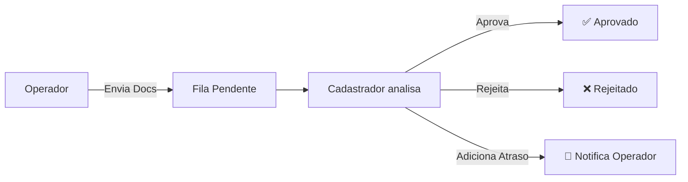
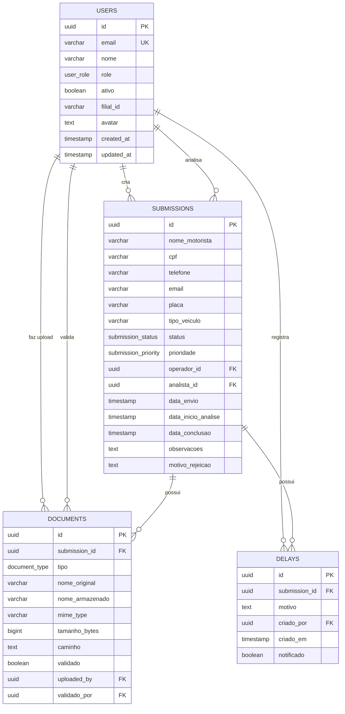

# 🚛 BBT Connect

> **Sistema de Integração Interna para Cadastro de Motoristas**  
> Desenvolvido para BBT Transportes

[](https://nodejs.org/)
[](https://reactjs.org/)
[](https://www.typescriptlang.org/)
[](https://www.postgresql.org/)
[](https://www.docker.com/)

---

## 📋 Índice

- [Visão Geral](#-visão-geral)
- [Funcionalidades](#-funcionalidades)
- [Arquitetura](#-arquitetura)
- [Stack Tecnológico](#-stack-tecnológico)
- [Estrutura do Projeto](#-estrutura-do-projeto)
- [Instalação](#-instalação)
- [Configuração](#-configuração)
- [Executando o Projeto](#-executando-o-projeto)
- [Deploy com Docker](#-deploy-com-docker)
- [API Reference](#-api-reference)
- [Banco de Dados](#-banco-de-dados)
- [Sistema de Permissões](#-sistema-de-permissões)
- [Frontend](#-frontend)
- [Desenvolvimento](#-desenvolvimento)
- [Troubleshooting](#-troubleshooting)
- [Contribuição](#-contribuição)

---

## 🎯 Visão Geral

O **BBT Connect** é um sistema completo para gerenciamento do fluxo de cadastro de motoristas, permitindo:

- 📤 **Operadores** enviarem documentações de motoristas para análise
- 📋 **Cadastradores/GR** analisarem e aprovarem/rejeitarem cadastros
- 📊 **Gestores** acompanharem KPIs e performance do time
- 📺 **TV Displays** para visualização em tempo real
- 🔍 **Auditoria** completa de todas as operações

### Fluxo Principal



---

## ✨ Funcionalidades

### Para Operadores
- ✅ Envio de documentos de motoristas (CNH, CRLV, ANTT, etc.)
- ✅ Acompanhamento do status em tempo real
- ✅ Notificações de atrasos e rejeições
- ✅ Dashboard pessoal com métricas

### Para Cadastradores/GR
- ✅ Fila de cadastros com priorização (Urgente/Alta/Normal)
- ✅ Visualização e download de documentos
- ✅ Validação individual de documentos
- ✅ Aprovação/Rejeição com motivos categorizados
- ✅ Registro de atrasos com notificação automática

### Para Gestores
- ✅ Dashboard com KPIs gerenciais
- ✅ Ranking de operadores por performance
- ✅ Estatísticas de tempo médio de análise
- ✅ Gráficos de submissions por período
- ✅ Taxa de aprovação/rejeição

### Para Administradores
- ✅ Gerenciamento de usuários
- ✅ Configurações do sistema
- ✅ Auditoria com exportação
- ✅ Integrações externas

### TV Displays
- 📍 **Mapa** - Localização de cargas em tempo real
- 📊 **KPIs** - Indicadores principais
- 📋 **Cadastros** - Fila atual
- 🚨 **Alertas** - Notificações importantes

---

## 🏗️ Arquitetura

```
┌─────────────────────────────────────────────────────────────────┐
│                         FRONTEND                                 │
│                   React + Vite + TailwindCSS                    │
│                    (nginx em produção)                          │
└────────────────────────────┬────────────────────────────────────┘
                             │ HTTP/WebSocket
┌────────────────────────────▼────────────────────────────────────┐
│                         BACKEND                                  │
│               Express + TypeScript + Socket.IO                  │
│                   (Better-Auth para auth)                       │
└────────────────────────────┬────────────────────────────────────┘
                             │ Kysely ORM
┌────────────────────────────▼────────────────────────────────────┐
│                       POSTGRESQL                                 │
│               Banco de dados principal                          │
└─────────────────────────────────────────────────────────────────┘
```

### Comunicação Real-time

O sistema utiliza **Socket.IO** para:
- Atualização automática da fila de cadastros
- Notificações de atrasos para operadores
- Sincronização de dashboards

---

## 🛠️ Stack Tecnológico

### Backend
| Tecnologia | Versão | Uso |
|------------|--------|-----|
| Node.js | 20+ | Runtime JavaScript |
| Express | 4.18 | Framework HTTP |
| TypeScript | 5.x | Tipagem estática |
| Kysely | 0.27 | Query builder type-safe |
| Better-Auth | 1.x | Autenticação baseada em sessão |
| Socket.IO | 4.7 | WebSockets real-time |
| Zod | 3.24 | Validação de schemas |
| Winston | 3.x | Logging |
| Multer | 1.4 | Upload de arquivos |

### Frontend
| Tecnologia | Versão | Uso |
|------------|--------|-----|
| React | 18.2 | UI Library |
| Vite | 7.x | Build tool |
| TypeScript | 5.x | Tipagem estática |
| TailwindCSS | 4.x | Estilização |
| React Router | 6.x | Roteamento SPA |
| TanStack Query | 5.x | Data fetching/caching |
| Axios | 1.6 | Cliente HTTP |
| Framer Motion | 12.x | Animações |
| Recharts | 3.x | Gráficos |
| MapLibre GL | 5.x | Mapas |
| Lucide React | 0.312 | Ícones |

### Infraestrutura
| Tecnologia | Uso |
|------------|-----|
| Docker | Containerização |
| Docker Compose | Orquestração local |
| PostgreSQL 15 | Banco de dados |
| Nginx | Servidor web (frontend) |
| Portainer | Gerenciamento de containers |

---

## 📁 Estrutura do Projeto

```
bbt-connect/
├── 📁 packages/
│   ├── 📁 backend/                 # API Node.js/Express
│   │   ├── 📁 src/
│   │   │   ├── 📁 config/         # Configurações (env, db, logger)
│   │   │   ├── 📁 db/
│   │   │   │   └── 📁 migrations/ # Scripts SQL de migração
│   │   │   ├── 📁 middlewares/    # Auth, upload, rate-limit, error
│   │   │   ├── 📁 routes/         # Endpoints da API
│   │   │   ├── 📁 services/       # Lógica de negócio
│   │   │   ├── 📁 socket/         # Eventos Socket.IO
│   │   │   ├── 📁 types/          # Tipos TypeScript
│   │   │   ├── auth.ts            # Configuração Better-Auth
│   │   │   └── index.ts           # Entry point
│   │   ├── Dockerfile             # Build multi-stage
│   │   └── package.json
│   │
│   ├── 📁 frontend/               # React SPA
│   │   ├── 📁 src/
│   │   │   ├── 📁 components/     # Componentes reutilizáveis
│   │   │   │   ├── 📁 dashboard/  # Cards, gráficos, KPIs
│   │   │   │   ├── 📁 layout/     # MainLayout, Header, Sidebar
│   │   │   │   └── 📁 ui/         # Button, Input, Modal, Toast
│   │   │   ├── 📁 contexts/       # React Contexts (Auth)
│   │   │   ├── 📁 hooks/          # Custom hooks
│   │   │   ├── 📁 pages/          # Páginas da aplicação
│   │   │   │   ├── 📁 auth/       # Login
│   │   │   │   ├── 📁 dashboard/  # Operador, Gestão, CadastroGR
│   │   │   │   └── 📁 tv/         # Displays para TV
│   │   │   ├── 📁 services/       # API client, WebSocket
│   │   │   ├── 📁 types/          # Tipos TypeScript
│   │   │   └── 📁 utils/          # Funções utilitárias
│   │   ├── nginx.conf             # Configuração nginx
│   │   ├── Dockerfile             # Build multi-stage
│   │   └── package.json
│   │
│   └── 📁 shared/                 # Tipos compartilhados
│       ├── 📁 src/
│       │   └── index.ts           # Exports principais
│       └── package.json
│
├── 📁 docker/                     # Arquivos Docker auxiliares
├── 📁 docs/                       # Documentação adicional
├── 📁 tests/                      # Testes
│
├── docker-compose.yml             # Apenas infra (postgres/redis)
├── docker-compose.bbt.yml         # Stack completa para produção
├── docker-compose.portainer.yml   # Otimizado para Portainer
├── docker-compose.dev.yml         # Desenvolvimento local
│
├── .env                           # Variáveis de ambiente
├── .env.example                   # Template de variáveis
├── .env.portainer.example         # Template para Portainer
│
├── package.json                   # Monorepo root
├── pnpm-workspace.yaml            # Configuração pnpm workspaces
└── README.md                      # Este arquivo
```

---

## 🚀 Instalação

### Pré-requisitos

- **Node.js** 20+ ([download](https://nodejs.org/))
- **pnpm** 8+ (`npm install -g pnpm`)
- **Docker** e **Docker Compose** (para produção)
- **PostgreSQL** 15+ (ou usar Docker)

### Passos

1. **Clone o repositório**
```bash
git clone https://github.com/seu-usuario/bbt-connect.git
cd bbt-connect
```

2. **Instale as dependências**
```bash
pnpm install
```

3. **Configure as variáveis de ambiente**
```bash
cp .env.example .env
# Edite o arquivo .env com suas configurações
```

4. **Inicie o banco de dados** (se usando Docker)
```bash
docker-compose up -d postgres
```

5. **Execute as migrations**
```bash
cd packages/backend
pnpm migrate
```

6. **Inicie o desenvolvimento**
```bash
# Na raiz do projeto
pnpm dev
```

---

## ⚙️ Configuração

### Variáveis de Ambiente

Crie um arquivo `.env` na raiz do projeto com as seguintes variáveis:

```env
# ========================================
# DATABASE - PostgreSQL
# ========================================
POSTGRES_HOST=localhost
POSTGRES_PORT=5432
POSTGRES_DB=bbt_connect
POSTGRES_USER=bbt_user
POSTGRES_PASSWORD=sua_senha_segura

# ========================================
# BACKEND API
# ========================================
API_PORT=3001
API_HOST=localhost
NODE_ENV=development

# Autenticação (mínimo 32 caracteres)
BETTER_AUTH_SECRET=sua_chave_secreta_de_32_caracteres_minimo

# CORS
CORS_ORIGIN=http://localhost:5173

# ========================================
# FRONTEND
# ========================================
VITE_API_URL=http://localhost:3001
VITE_WS_URL=ws://localhost:3001

# ========================================
# UPLOADS
# ========================================
UPLOAD_DIR=./uploads
MAX_FILE_SIZE=52428800  # 50MB

# ========================================
# LOGS
# ========================================
LOG_LEVEL=debug
LOG_FILE=./logs/app.log
```

### Variáveis de Produção

Para produção, adicione/modifique:

```env
NODE_ENV=production
CORS_ORIGIN=https://seu-dominio.com.br
POSTGRES_PASSWORD=senha_muito_forte_123!@#
BETTER_AUTH_SECRET=chave_aleatoria_segura_de_pelo_menos_32_caracteres
```

---

## ▶️ Executando o Projeto

### Desenvolvimento

```bash
# Inicia backend + frontend simultaneamente
pnpm dev

# Ou separadamente:
cd packages/backend && pnpm dev    # Backend em http://localhost:3001
cd packages/frontend && pnpm dev   # Frontend em http://localhost:5173
```

### Produção (Local)

```bash
# Build
cd packages/backend && pnpm build
cd packages/frontend && pnpm build

# Start
cd packages/backend && pnpm start
# Frontend: servir /packages/frontend/dist com nginx ou servidor estático
```

---

## 🐳 Deploy com Docker

### Opção 1: Docker Compose Local

```bash
# Build e inicia todos os serviços
docker-compose -f docker-compose.bbt.yml up -d --build

# Verificar logs
docker-compose -f docker-compose.bbt.yml logs -f

# Parar
docker-compose -f docker-compose.bbt.yml down
```

### Opção 2: Portainer

Use o arquivo `docker-compose.portainer.yml` que possui:
- Nomes de containers únicos (evita conflitos)
- Portas configuráveis via variáveis de ambiente
- Network isolada

**Passos:**
1. Acesse seu Portainer
2. Vá em **Stacks** → **Add Stack**
3. Cole o conteúdo de `docker-compose.portainer.yml`
4. Configure as variáveis de ambiente
5. Deploy

### Portas Padrão

| Serviço | Porta Local | Porta Portainer |
|---------|-------------|-----------------|
| Frontend | 80 | 3009 |
| Backend | 3001 | 3010 |
| PostgreSQL | 5432 | 5433 |

---

## 📚 API Reference

Base URL: `http://localhost:3001/api`

### Autenticação

| Método | Endpoint | Descrição |
|--------|----------|-----------|
| POST | `/auth/sign-in/email` | Login com email/senha |
| POST | `/auth/sign-out` | Logout |
| GET | `/auth/me` | Dados do usuário logado |
| GET | `/auth/check` | Verificar se está autenticado |
| GET | `/auth/permissions` | Permissões do usuário |

**Exemplo de Login:**
```bash
curl -X POST http://localhost:3001/api/auth/sign-in/email \
  -H "Content-Type: application/json" \
  -d '{"email": "admin@bbt.com.br", "password": "senha123"}'
```

### Fila de Cadastros

| Método | Endpoint | Descrição | Permissão |
|--------|----------|-----------|-----------|
| GET | `/fila` | Listar submissions | Autenticado |
| GET | `/fila/stats` | Estatísticas | Cadastrador/Gestor |
| GET | `/fila/:id` | Detalhes | Autenticado |
| POST | `/fila` | Criar submission | `criarCadastros` |
| PUT | `/fila/:id` | Atualizar | `editarCadastros` |
| POST | `/fila/:id/analisar` | Iniciar análise | `aprovarCadastros` |
| POST | `/fila/:id/aprovar` | Aprovar | `aprovarCadastros` |
| POST | `/fila/:id/rejeitar` | Rejeitar | `aprovarCadastros` |
| POST | `/fila/:id/adicionar-atraso` | Registrar atraso | `aprovarCadastros` |
| GET | `/fila/:id/delays` | Listar atrasos | Autenticado |

**Exemplo - Criar Submission:**
```bash
curl -X POST http://localhost:3001/api/fila \
  -H "Content-Type: application/json" \
  -H "Cookie: session=..." \
  -d '{
    "nomeMotorista": "João Silva",
    "cpf": "123.456.789-00",
    "telefone": "(11) 99999-9999",
    "placa": "ABC-1234",
    "prioridade": "normal"
  }'
```

### Documentos

| Método | Endpoint | Descrição | Permissão |
|--------|----------|-----------|-----------|
| GET | `/documents` | Listar documentos | Autenticado |
| GET | `/documents/:id` | Metadados | Autenticado |
| GET | `/documents/:id/download` | Download | Autenticado |
| POST | `/documents/upload` | Upload único | `criarCadastros` |
| POST | `/documents/upload-multiple` | Upload múltiplo | `criarCadastros` |
| PUT | `/documents/:id/validar` | Validar documento | `aprovarCadastros` |
| DELETE | `/documents/:id` | Remover | `deletarCadastros` |

**Tipos de Documento:**
- `crlv` - CRLV do veículo
- `antt` - Registro ANTT
- `cnh` - CNH do motorista
- `endereco` - Comprovante de endereço
- `bancario` - Dados bancários
- `pamcard` - Cartão PAMCARD
- `gr` - GR
- `rcv` - RCV
- `contrato` - Contrato
- `outros` - Outros documentos

### Dashboard

| Método | Endpoint | Descrição | Permissão |
|--------|----------|-----------|-----------|
| GET | `/dashboard/stats` | Estatísticas gerais | Gestor/Cadastrador |
| GET | `/dashboard/submissions-por-dia` | Gráfico por período | Gestor/Cadastrador |
| GET | `/dashboard/top-operadores` | Ranking operadores | Gestor |
| GET | `/dashboard/meu-resumo` | Resumo pessoal | Autenticado |
| GET | `/dashboard/delay-stats` | Estatísticas de atrasos | Gestor/Cadastrador |
| GET | `/dashboard/audit-metrics` | Métricas de auditoria | Auditor |

### Usuários

| Método | Endpoint | Descrição | Permissão |
|--------|----------|-----------|-----------|
| GET | `/users` | Listar usuários | Admin |
| GET | `/users/:id` | Detalhes | Admin |
| POST | `/users` | Criar usuário | Admin |
| PUT | `/users/:id` | Atualizar | Admin |
| DELETE | `/users/:id` | Desativar | Admin |

### Tickets (Suporte)

| Método | Endpoint | Descrição |
|--------|----------|-----------|
| GET | `/tickets` | Listar tickets |
| POST | `/tickets` | Criar ticket |

---

## 🗄️ Banco de Dados

### Diagrama ER



### Migrations

As migrations estão em `packages/backend/src/db/migrations/`:

| Arquivo | Descrição |
|---------|-----------|
| `001_users.sql` | Tabela de usuários e roles |
| `002_better_auth.sql` | Tabelas do Better-Auth (sessions, accounts) |
| `003_submissions.sql` | Fila de cadastros |
| `004_documents.sql` | Documentos enviados |
| `005_audit_logs.sql` | Logs de auditoria |
| `006_workflow_enhancements.sql` | Delays e melhorias |

### Enums

**user_role:**
- `admin` - Administrador do sistema
- `gestor` - Gestor/Supervisor
- `operacional` - Operador de campo
- `cadastro` - Cadastrador/GR
- `comercial` - Equipe comercial
- `auditor` - Auditor

**submission_status:**
- `pendente` - Aguardando análise
- `em_analise` - Sendo analisado
- `aprovado` - Cadastro aprovado
- `rejeitado` - Cadastro rejeitado

**submission_priority:**
- `normal` - Prioridade normal
- `alta` - Alta prioridade
- `urgente` - Urgente

**document_type:**
- `crlv`, `antt`, `cnh`, `endereco`, `bancario`, `pamcard`, `gr`, `rcv`, `contrato`, `outros`

---

## 🔐 Sistema de Permissões

O sistema utiliza **RBAC (Role-Based Access Control)** com as seguintes permissões:

| Permissão | Admin | Gestor | Operacional | Cadastro | Comercial | Auditor |
|-----------|:-----:|:------:|:-----------:|:--------:|:---------:|:-------:|
| viewDashboardOperador | ✅ | ✅ | ✅ | ❌ | ❌ | ❌ |
| viewDashboardGestao | ✅ | ✅ | ❌ | ❌ | ✅ | ❌ |
| viewDashboardCadastroGR | ✅ | ✅ | ❌ | ✅ | ❌ | ❌ |
| viewTvDisplay | ✅ | ✅ | ✅ | ✅ | ✅ | ❌ |
| viewAuditoria | ✅ | ✅ | ❌ | ❌ | ✅ | ✅ |
| exportAuditoria | ✅ | ✅ | ❌ | ❌ | ❌ | ✅ |
| viewConfiguracoesPessoais | ✅ | ✅ | ✅ | ✅ | ✅ | ✅ |
| viewConfiguracoesSistema | ✅ | ❌ | ❌ | ❌ | ❌ | ❌ |
| manageUsers | ✅ | ❌ | ❌ | ❌ | ❌ | ❌ |
| manageIntegracoes | ✅ | ❌ | ❌ | ❌ | ❌ | ❌ |
| aprovarCadastros | ✅ | ✅ | ❌ | ✅ | ❌ | ❌ |
| editarCadastros | ✅ | ✅ | ❌ | ✅ | ❌ | ❌ |
| criarCadastros | ✅ | ✅ | ✅ | ❌ | ❌ | ❌ |
| deletarCadastros | ✅ | ❌ | ❌ | ❌ | ❌ | ❌ |

---

## 🖥️ Frontend

### Rotas

| Rota | Componente | Descrição | Acesso |
|------|------------|-----------|--------|
| `/login` | Login | Tela de login | Público |
| `/dashboard/operador` | DashboardOperador | Envio de documentos | Operador |
| `/dashboard/gestao` | DashboardGestao | KPIs gerenciais | Gestor |
| `/dashboard/cadastro-gr` | DashboardCadastroGR | Fila de cadastros | Cadastrador |
| `/dashboard/kpi/:tipo` | KpiDetalhes | Detalhes de KPI | Gestor |
| `/auditoria` | Auditoria | Logs e métricas | Auditor |
| `/configuracoes` | Configuracoes | Preferências | Autenticado |
| `/notificacoes` | Notificacoes | Central de notificações | Autenticado |
| `/tv/mapa` | TvMapa | Mapa de cargas | TV |
| `/tv/kpis` | TvKpis | KPIs para TV | TV |
| `/tv/cadastros` | TvCadastros | Fila em TV | TV |
| `/tv/alertas` | TvAlertas | Alertas em TV | TV |

### Componentes Principais

```
components/
├── dashboard/
│   ├── KpiCard.tsx          # Card de indicador
│   ├── StatsChart.tsx       # Gráfico de estatísticas
│   └── FilaTable.tsx        # Tabela da fila
├── layout/
│   ├── MainLayout.tsx       # Layout principal
│   ├── Header.tsx           # Header com usuário
│   └── Sidebar.tsx          # Menu lateral
└── ui/
    ├── Button.tsx           # Botão estilizado
    ├── Input.tsx            # Campo de input
    ├── Modal.tsx            # Modal/Dialog
    ├── Toast.tsx            # Notificações toast
    └── Loading.tsx          # Indicador de loading
```

---

## 👨‍💻 Desenvolvimento

### Scripts Disponíveis

**Raiz do projeto:**
```bash
pnpm dev          # Inicia todos os pacotes em modo dev
pnpm build        # Build de produção
pnpm lint         # Linting
pnpm typecheck    # Verificação de tipos
```

**Backend:**
```bash
cd packages/backend
pnpm dev          # Desenvolvimento com hot-reload
pnpm build        # Compila TypeScript
pnpm start        # Inicia produção
pnpm migrate      # Executa migrations
pnpm seed         # Popula dados iniciais
pnpm typecheck    # Verifica tipos
```

**Frontend:**
```bash
cd packages/frontend
pnpm dev          # Servidor de desenvolvimento
pnpm build        # Build para produção
pnpm preview      # Preview do build
pnpm lint         # ESLint
pnpm typecheck    # Verifica tipos
```

### Estrutura de Código

**Backend - Criando nova rota:**
1. Crie o arquivo em `src/routes/sua-rota.routes.ts`
2. Registre em `src/routes/index.ts`
3. Adicione tipos em `src/types/`

**Frontend - Criando nova página:**
1. Crie o componente em `src/pages/SuaPagina.tsx`
2. Adicione a rota em `src/App.tsx`
3. Atualize o menu em `components/layout/Sidebar.tsx`

---

## 🔧 Troubleshooting

### Erro de conexão com banco

```bash
# Verificar se PostgreSQL está rodando
docker ps | grep postgres

# Ver logs do container
docker logs bbt-connect-postgres
```

### Frontend não conecta ao backend

1. Verifique `VITE_API_URL` no `.env`
2. Confirme que o backend está rodando
3. Verifique CORS no backend

### Upload de arquivos falha

1. Verifique permissões da pasta `uploads/`
2. Confirme `MAX_FILE_SIZE` no `.env`
3. Verifique espaço em disco

### Migrations não executam

```bash
# Executar manualmente
cd packages/backend
pnpm migrate

# Ou via Docker
docker exec -it bbt-connect-backend node dist/db/migrate.js
```

---

## 🤝 Contribuição

1. Fork o repositório
2. Crie uma branch (`git checkout -b feature/nova-funcionalidade`)
3. Commit suas mudanças (`git commit -m 'feat: adiciona nova funcionalidade'`)
4. Push para a branch (`git push origin feature/nova-funcionalidade`)
5. Abra um Pull Request

### Convenção de Commits

Usamos [Conventional Commits](https://www.conventionalcommits.org/):

- `feat:` - Nova funcionalidade
- `fix:` - Correção de bug
- `docs:` - Documentação
- `style:` - Formatação
- `refactor:` - Refatoração
- `test:` - Testes
- `chore:` - Manutenção

---

## 📄 Licença

Este projeto é proprietário da **BBT Transportes**.

---

## 📞 Suporte

Para suporte técnico, entre em contato com a equipe de TI.

---

<p align="center">
  Desenvolvido com ❤️ para <strong>BBT Transportes</strong>
</p>
